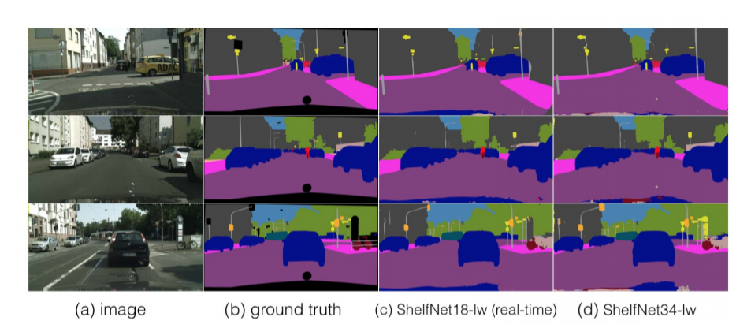
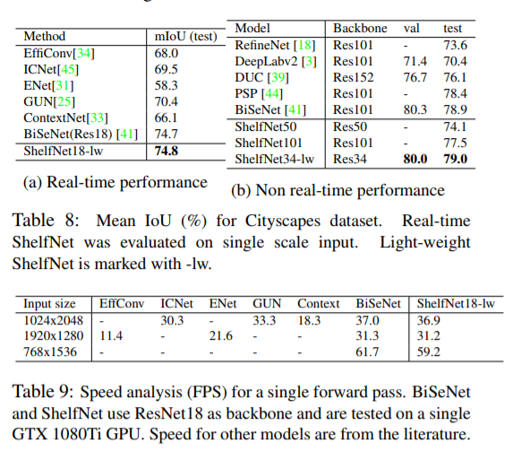

# ShelfNet-lightweight for paper ([ShelfNet for fast semantic segmentation](https://arxiv.org/abs/1811.11254))
* This repo contains implementation of ShelfNet-lightweight models for real-time models on Cityscapes. <br/>
* For real-time tasks, we achieved 74.8% mIoU on Ctiyscapes dataset, with a speed of 59.2 FPS (61.7 FPS for BiSeNet at 74.7% on a GTX 1080Ti GPU). <br/>
* For non real-time tasks, we achieved 79.0% mIoU on Cityscapes test set with ResNet34 backbone, suparssing other models (PSPNet and BiSeNet) with largers backbones with ResNet50 or Resnet 101 backbone. <br/>
* For Non light-weight ShelfNet implementation, refer to another [ShelfNet repo](https://github.com/juntang-zhuang/ShelfNet). <br/>
* This branch is the result on Cityscapes experiment, for results on PASCAL, see branch ```pascal```

This repo is based on two implementations [Implementation 1](https://github.com/ycszen/TorchSeg) and [Implementation 2](https://github.com/CoinCheung/BiSeNet). This implementation takes about 24h's training on 2 GTX 1080Ti GPU. <br/>

## Results
</br>
 </br>

## Link to results on Cityscapes test set
ShelfNet18-lw real-time: [https://www.cityscapes-dataset.com/anonymous-results/?id=b2cc8f49fc3267c73e6bb686425016cb152c8bc34fc09ac207c81749f329dc8d](https://www.cityscapes-dataset.com/anonymous-results/?id=b2cc8f49fc3267c73e6bb686425016cb152c8bc34fc09ac207c81749f329dc8d) <br/>
ShelfNet34-lw non real-time: [https://www.cityscapes-dataset.com/anonymous-results/?id=c0a7c8a4b64a880a715632c6a28b116d239096b63b5d14f5042c8b3280a7169d](https://www.cityscapes-dataset.com/anonymous-results/?id=c0a7c8a4b64a880a715632c6a28b116d239096b63b5d14f5042c8b3280a7169d)

## Data Preparation
Download fine labelled dataset from Cityscapes server, and decompress into ```./data``` folder. <br />
You might need to modify data path [here](https://github.com/NoName-sketch/anonymous/blob/master/ShelfNet18_realtime/train.py/#L58) and [here](https://github.com/NoName-sketch/anonymous/blob/master/ShelfNet18_realtime/evaluate.py/#L143)<br/>
```
$ mkdir -p data
$ mv /path/to/leftImg8bit_trainvaltest.zip data
$ mv /path/to/gtFine_trainvaltest.zip data
$ cd data
$ unzip leftImg8bit_trainvaltest.zip
$ unzip gtFine_trainvaltest.zip
```

## Two models and the pretrained weights
We provide two models, ShelfNet18 with 64 base channels for real-time semantic segmentation, and ShelfNet34 with 128 base channels for non-real-time semantic segmentation. <br/>Pretrained weights for [ShelfNet18](https://www.dropbox.com/s/84ol8lk99qcis9p/ShelfNet18_realtime.pth?dl=0) and [ShelfNet34](https://www.dropbox.com/s/q9jae02qe27wwa3/ShelfNet34_non_realtime.pth?dl=0).

## Requirements
PyTorch 1.0 or higher <br/>
python3 <br/>
scikit-image <br/>
tqdm<br/>

## How to run
Find the folder (```cd ShelfNet18_realtime``` or ```cd ShelfNet34_non_realtime```)

training
```
CUDA_VISIBLE_DEVICES=0,1 python -m torch.distributed.launch --nproc_per_node=2 train.py
```

evaluate on validation set (Create a folder called ```res```, this folder is automatically created if you train the model. Put checkpoint in ```res```folder, and make sure the checkpoint name and dataset path match ```evaluate.py```. Change checkpoint name to ```model_final.pth```by default)
```
python evaluate.py
```

## Running speed
test running speed of ShelfNet18-lw
```
python test_speed.py
```

You can modify the shape of input images to test running speed, by modifying [here](https://github.com/NoName-sketch/anonymous/blob/master/ShelfNet18_realtime/test_LWRF_speed.py#L32) <br />
You can test running speed of different models by modifying [here](https://github.com/NoName-sketch/anonymous/blob/master/ShelfNet18_realtime/test_LWRF_speed.py#L20) <br />
The running speed is an average of 100 single forward passes, therefore it's possible the speed varies. The code returns the mean running time by default.
