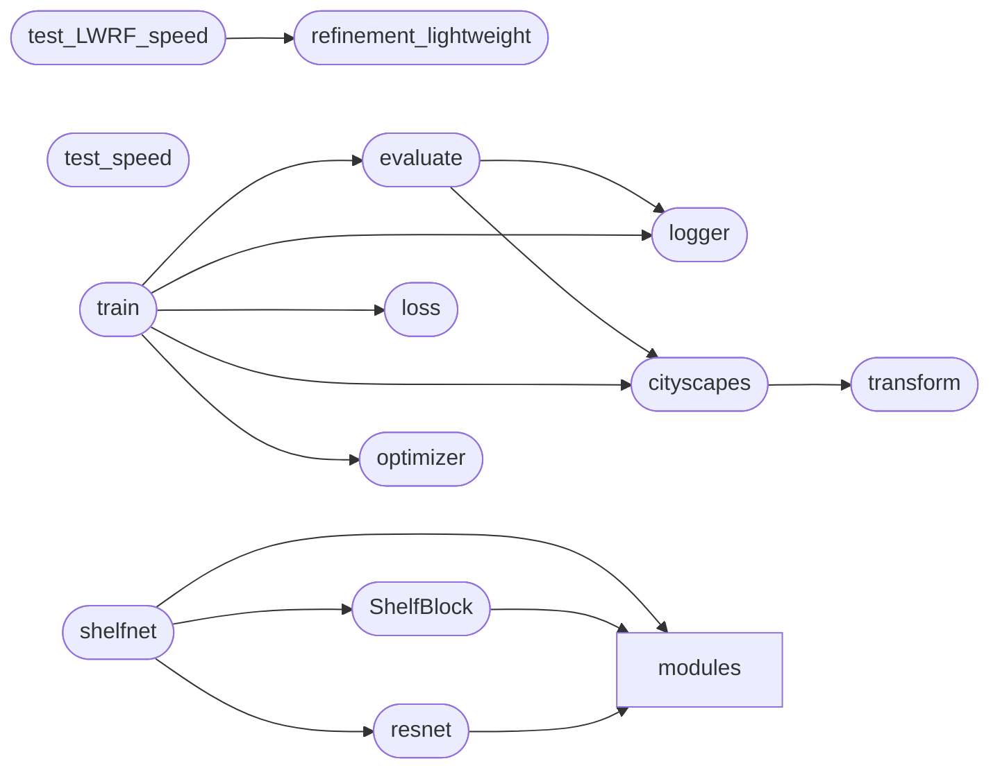

# Code Overview

[_Documentation generated by Documatic_](https://www.documatic.com)

<!---Documatic-section-Codebase Structure Python-start--->
## Codebase Structure Python

The codebase has a single-depth folder structure,
                with 20 code files in total.

<!---Documatic-block-system_architecture-start--->

<!---Documatic-block-system_architecture-end--->

# #
<!---Documatic-section-Codebase Structure Python-end--->

<!---Documatic-section-Important Functions-start--->
## Important Functions

<!---Documatic-block-important_funcs-start--->
<!---Documatic-block-most_used_funcs-start--->
### Most Utilised Functions

* ShelfNet18_realtime.logger.setup_logger (2 times)
* ShelfNet18_realtime.refinement_lightweight.rf_lw50 (1 times)
* ShelfNet18_realtime.refinement_lightweight.rf_lw101 (1 times)
* ShelfNet18_realtime.refinement_lightweight.rf_lw152 (1 times)
* ShelfNet18_realtime.evaluate.evaluate (1 times)
<!---Documatic-block-most_used_funcs-end--->
<!---Documatic-block-important_funcs-end--->

# #
<!---Documatic-section-Important Functions-end--->

<!---Documatic-section-File IO-start--->
## File IO

<!---Documatic-block-file_io-start--->
The following files have file read operations

<!---Documatic-block-ShelfNet18_realtime-start--->

	
<code>ShelfNet18_realtime</code> (Click to Expand!)

* ShelfNet18_realtime.cityscapes: ./cityscapes_info.json
* ShelfNet18_realtime.transform: data/img.jpg, data/label.png

<!---Documatic-block-ShelfNet18_realtime-end--->
<!---Documatic-block-file_io-end--->

# #
<!---Documatic-section-File IO-end--->

<!---Documatic-section-Class Hierarchy-start--->
## Class Hierarchy

<!---Documatic-block-ShelfNet18_realtime.modules.bn.ABN-start--->

	
<code>ShelfNet18_realtime.modules.bn.ABN</code> (Click to Expand!)

* ShelfNet18_realtime.modules.bn.InPlaceABN
* ShelfNet18_realtime.modules.bn.InPlaceABNSync

<!---Documatic-block-ShelfNet18_realtime.modules.bn.ABN-end--->

<!---Documatic-block-nn.Module-start--->

	
<code>nn.Module</code> (Click to Expand!)

* ShelfNet18_realtime.modules.bn.ABN
* ShelfNet18_realtime.refinement_lightweight.BasicBlock
* ShelfNet18_realtime.refinement_lightweight.CRPBlock

<!---Documatic-block-nn.Module-end--->

<!---Documatic-block-object-start--->

	
<code>object</code> (Click to Expand!)

* ShelfNet18_realtime.transform.ColorJitter
* ShelfNet18_realtime.transform.Compose
* ShelfNet18_realtime.transform.HorizontalFlip
* ShelfNet18_realtime.transform.MultiScale
* ShelfNet18_realtime.transform.RandomCrop
* ShelfNet18_realtime.transform.RandomScale

<!---Documatic-block-object-end--->

# #
<!---Documatic-section-Class Hierarchy-end--->

[_Documentation generated by Documatic_](https://www.documatic.com)