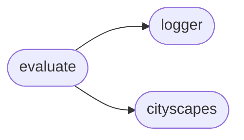
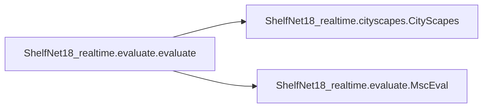

# Shelfnet18 Realtime Evaluate

[_Documentation generated by Documatic_](https://www.documatic.com)

<!---Documatic-section-Codebase Structure-start--->
## Codebase Structure

<!---Documatic-block-system_architecture-start--->

<!---Documatic-block-system_architecture-end--->

# #
<!---Documatic-section-Codebase Structure-end--->

<!---Documatic-section-ShelfNet18_realtime.evaluate.evaluate-start--->
## ShelfNet18_realtime.evaluate.evaluate

<!---Documatic-section-evaluate-start--->


### Object Calls

* ShelfNet18_realtime.cityscapes.CityScapes
* ShelfNet18_realtime.evaluate.MscEval

<!---Documatic-block-ShelfNet18_realtime.evaluate.evaluate-start--->
<details>
	<summary><code>ShelfNet18_realtime.evaluate.evaluate</code> code snippet</summary>

```python
def evaluate(respth='./res', dspth='/data2/.encoding/data/cityscapes', checkpoint=None):
    logger = logging.getLogger()
    logger.info('\n')
    logger.info('====' * 20)
    logger.info('evaluating the model ...\n')
    logger.info('setup and restore model')
    n_classes = 19
    net = ShelfNet(n_classes=n_classes)
    if checkpoint is None:
        save_pth = osp.join(respth, 'model_final.pth')
    else:
        save_pth = checkpoint
    net.load_state_dict(torch.load(save_pth))
    net.cuda()
    net.eval()
    batchsize = 5
    n_workers = 2
    dsval = CityScapes(dspth, mode='val')
    dl = DataLoader(dsval, batch_size=batchsize, shuffle=False, num_workers=n_workers, drop_last=False)
    logger.info('compute the mIOU')
    evaluator = MscEval(net, dl, scales=[1.0], flip=False)
    mIOU = evaluator.evaluate()
    logger.info('mIOU is: {:.6f}'.format(mIOU))
```
</details>
<!---Documatic-block-ShelfNet18_realtime.evaluate.evaluate-end--->
<!---Documatic-section-evaluate-end--->

# #
<!---Documatic-section-ShelfNet18_realtime.evaluate.evaluate-end--->

<!---Documatic-section-ShelfNet18_realtime.evaluate.MscEval-start--->
## ShelfNet18_realtime.evaluate.MscEval

<!---Documatic-section-MscEval-start--->
<!---Documatic-block-ShelfNet18_realtime.evaluate.MscEval-start--->
<details>
	<summary><code>ShelfNet18_realtime.evaluate.MscEval</code> code snippet</summary>

```python
class MscEval(object):

    def __init__(self, model, dataloader, scales=[1.0], n_classes=19, lb_ignore=255, cropsize=1024, flip=False, *args, **kwargs):
        self.scales = scales
        self.n_classes = n_classes
        self.lb_ignore = lb_ignore
        self.flip = flip
        self.cropsize = cropsize
        self.dl = dataloader
        self.net = model

    def pad_tensor(self, inten, size):
        (N, C, H, W) = inten.size()
        outten = torch.zeros(N, C, size[0], size[1]).cuda()
        outten.requires_grad = False
        (margin_h, margin_w) = (size[0] - H, size[1] - W)
        (hst, hed) = (margin_h // 2, margin_h // 2 + H)
        (wst, wed) = (margin_w // 2, margin_w // 2 + W)
        outten[:, :, hst:hed, wst:wed] = inten
        return (outten, [hst, hed, wst, wed])

    def eval_chip(self, crop):
        with torch.no_grad():
            out = self.net(crop)[0]
            prob = F.softmax(out, 1)
            if self.flip:
                crop = torch.flip(crop, dims=(3,))
                out = self.net(crop)[0]
                out = torch.flip(out, dims=(3,))
                prob += F.softmax(out, 1)
        return prob

    def crop_eval(self, im):
        cropsize = self.cropsize
        stride_rate = 1.0
        (N, C, H, W) = im.size()
        (long_size, short_size) = (H, W) if H > W else (W, H)
        if long_size < cropsize:
            (im, indices) = self.pad_tensor(im, (cropsize, cropsize))
            prob = self.eval_chip(im)
            prob = prob[:, :, indices[0]:indices[1], indices[2]:indices[3]]
        else:
            stride = math.ceil(cropsize * stride_rate)
            if short_size < cropsize:
                if H < W:
                    (im, indices) = self.pad_tensor(im, (cropsize, W))
                else:
                    (im, indices) = self.pad_tensor(im, (H, cropsize))
            (N, C, H, W) = im.size()
            n_x = math.ceil((W - cropsize) / stride) + 1
            n_y = math.ceil((H - cropsize) / stride) + 1
            prob = torch.zeros(N, self.n_classes, H, W).cuda()
            prob.requires_grad = False
            for iy in range(n_y):
                for ix in range(n_x):
                    (hed, wed) = (min(H, stride * iy + cropsize), min(W, stride * ix + cropsize))
                    (hst, wst) = (hed - cropsize, wed - cropsize)
                    chip = im[:, :, hst:hed, wst:wed]
                    prob_chip = self.eval_chip(chip)
                    prob[:, :, hst:hed, wst:wed] += prob_chip
            if short_size < cropsize:
                prob = prob[:, :, indices[0]:indices[1], indices[2]:indices[3]]
        return prob

    def scale_crop_eval(self, im, scale):
        (N, C, H, W) = im.size()
        new_hw = [int(H * scale), int(W * scale)]
        im = F.interpolate(im, new_hw, mode='bilinear', align_corners=True)
        prob = self.crop_eval(im)
        prob = F.interpolate(prob, (H, W), mode='bilinear', align_corners=True)
        return prob

    def compute_hist(self, pred, lb):
        n_classes = self.n_classes
        ignore_idx = self.lb_ignore
        keep = np.logical_not(lb == ignore_idx)
        merge = pred[keep] * n_classes + lb[keep]
        hist = np.bincount(merge, minlength=n_classes ** 2)
        hist = hist.reshape((n_classes, n_classes))
        return hist

    def evaluate(self):
        n_classes = self.n_classes
        hist = np.zeros((n_classes, n_classes), dtype=np.float32)
        dloader = tqdm(self.dl)
        if dist.is_initialized() and (not dist.get_rank() == 0):
            dloader = self.dl
        for (i, (imgs, label)) in enumerate(dloader):
            (N, _, H, W) = label.shape
            probs = torch.zeros((N, self.n_classes, H, W))
            probs.requires_grad = False
            imgs = imgs.cuda()
            for sc in self.scales:
                prob = self.scale_crop_eval(imgs, sc)
                probs += prob.detach().cpu()
            probs = probs.data.numpy()
            preds = np.argmax(probs, axis=1)
            hist_once = self.compute_hist(preds, label.data.numpy().squeeze(1))
            hist = hist + hist_once
        IOUs = np.diag(hist) / (np.sum(hist, axis=0) + np.sum(hist, axis=1) - np.diag(hist))
        mIOU = np.mean(IOUs)
        return mIOU
```
</details>
<!---Documatic-block-ShelfNet18_realtime.evaluate.MscEval-end--->
<!---Documatic-section-MscEval-end--->

# #
<!---Documatic-section-ShelfNet18_realtime.evaluate.MscEval-end--->

[_Documentation generated by Documatic_](https://www.documatic.com)