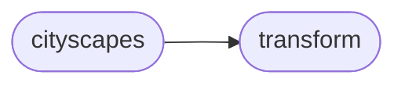

# Shelfnet18 Realtime Cityscapes

[_Documentation generated by Documatic_](https://www.documatic.com)

<!---Documatic-section-Codebase Structure-start--->
## Codebase Structure

<!---Documatic-block-system_architecture-start--->

<!---Documatic-block-system_architecture-end--->

# #
<!---Documatic-section-Codebase Structure-end--->

<!---Documatic-section-ShelfNet18_realtime.cityscapes.CityScapes-start--->
## ShelfNet18_realtime.cityscapes.CityScapes

<!---Documatic-section-CityScapes-start--->
<!---Documatic-block-ShelfNet18_realtime.cityscapes.CityScapes-start--->
<details>
	<summary><code>ShelfNet18_realtime.cityscapes.CityScapes</code> code snippet</summary>

```python
class CityScapes(Dataset):

    def __init__(self, rootpth, cropsize=(640, 480), mode='train', label_scale=1.0, *args, **kwargs):
        super(CityScapes, self).__init__(*args, **kwargs)
        assert mode in ('train', 'val', 'test')
        self.mode = mode
        self.ignore_lb = 255
        self.label_scale = label_scale
        with open('./cityscapes_info.json', 'r') as fr:
            labels_info = json.load(fr)
        self.lb_map = {el['id']: el['trainId'] for el in labels_info}
        self.imgs = {}
        imgnames = []
        impth = osp.join(rootpth, 'leftImg8bit', mode)
        folders = os.listdir(impth)
        for fd in folders:
            fdpth = osp.join(impth, fd)
            im_names = os.listdir(fdpth)
            names = [el.replace('_leftImg8bit.png', '') for el in im_names]
            impths = [osp.join(fdpth, el) for el in im_names]
            imgnames.extend(names)
            self.imgs.update(dict(zip(names, impths)))
        self.labels = {}
        gtnames = []
        if self.mode == 'test':
            gtpth = osp.join(rootpth, mode)
        else:
            gtpth = osp.join(rootpth, 'gtFine', mode)
        folders = os.listdir(gtpth)
        for fd in folders:
            if fd == 'info.json':
                continue
            fdpth = osp.join(gtpth, fd)
            lbnames = os.listdir(fdpth)
            lbnames = [el for el in lbnames if 'labelIds' in el]
            names = [el.replace('_gtFine_labelIds.png', '') for el in lbnames]
            lbpths = [osp.join(fdpth, el) for el in lbnames]
            gtnames.extend(names)
            self.labels.update(dict(zip(names, lbpths)))
        self.imnames = imgnames
        self.len = len(self.imnames)
        if self.mode != 'test':
            assert set(imgnames) == set(gtnames)
            assert set(self.imnames) == set(self.imgs.keys())
            assert set(self.imnames) == set(self.labels.keys())
        self.to_tensor = transforms.Compose([transforms.ToTensor(), transforms.Normalize((0.485, 0.456, 0.406), (0.229, 0.224, 0.225))])
        self.trans_train = Compose([ColorJitter(brightness=0.5, contrast=0.5, saturation=0.5), HorizontalFlip(), RandomScale((0.75, 1.0, 1.25, 1.5, 1.75, 2.0)), RandomCrop(cropsize)])

    def __getitem__(self, idx):
        fn = self.imnames[idx]
        impth = self.imgs[fn]
        img = Image.open(impth)
        if self.mode != 'test':
            lbpth = self.labels[fn]
            label = Image.open(lbpth)
        if self.mode == 'train':
            im_lb = dict(im=img, lb=label)
            im_lb = self.trans_train(im_lb)
            (img, label) = (im_lb['im'], im_lb['lb'])
            img = self.to_tensor(img)
            label = np.array(label).astype(np.int64)[np.newaxis, :]
            label = self.convert_labels(label)
            return (img, label)
        elif self.mode == 'val':
            img = self.to_tensor(img)
            if self.label_scale != 1.0:
                (H, W) = label.size
                label = label.resize((int(H * self.label_scale), int(W * self.label_scale)), Image.NEAREST)
            label = np.array(label).astype(np.int64)[np.newaxis, :]
            label = self.convert_labels(label)
            return (img, label)
        else:
            img = self.to_tensor(img)
            return (img, impth)

    def __len__(self):
        return self.len

    def convert_labels(self, label):
        for (k, v) in self.lb_map.items():
            label[label == k] = v
        return label
```
</details>
<!---Documatic-block-ShelfNet18_realtime.cityscapes.CityScapes-end--->
<!---Documatic-section-CityScapes-end--->

# #
<!---Documatic-section-ShelfNet18_realtime.cityscapes.CityScapes-end--->

[_Documentation generated by Documatic_](https://www.documatic.com)